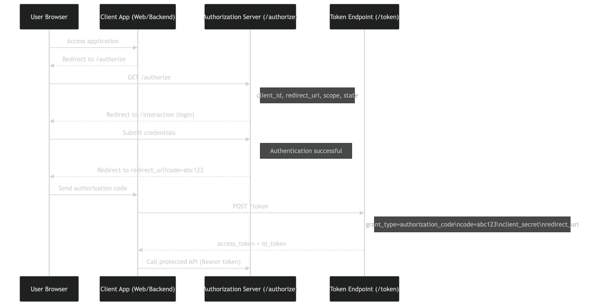
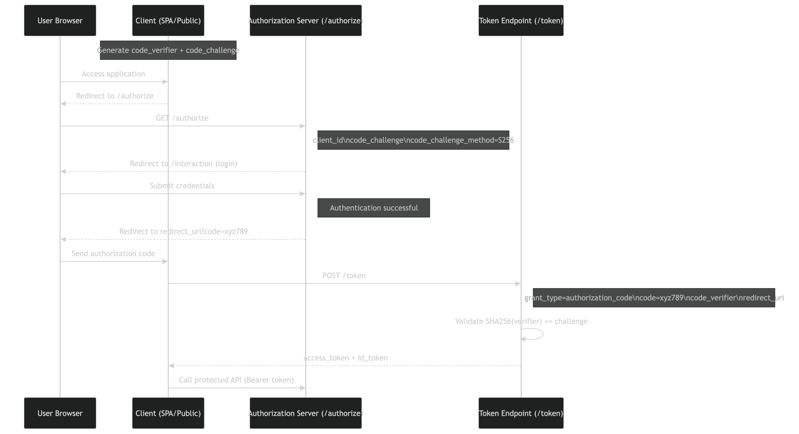

## 1. 🧠 System Overview

The system is a custom Identity Provider (IdP) implementing:

- OAuth 2.0 Authorization Code Flow
- OpenID Connect (OIDC)
- Token issuance (JWT)
- Interaction-based authentication (login + consent)
- JWKS-based cryptographic trust

The platform acts as a central authentication and token authority for client applications.

## 2. 🎯 Objectives
Provide secure authentication using OIDC
Issue verifiable JWT tokens
Enable integration with client applications
Enforce standardized identity protocols
Support extensibility (RBAC, federation, lifecycle)


## 3. 🏗️ Architecture Overview
  
                ┌──────────────────────┐
                │   Client Application │
                │ (Browser / Backend)  │
                └──────────┬───────────┘
                           │
                    Authorization Code Flow
                           │
        ┌──────────────────▼──────────────────┐
        │        Identity Platform (IdP)      │
        │-------------------------------------│
        │  Express Server                     │
        │  OIDC Provider Engine               │
        │  Interaction Layer (Login/Consent). │
        │  Token Service (JWT + JWK)          │
        │  User Service (AuthN)               │
        └──────────┬──────────────┬────────---┘
                   │              │
         ┌────────▼──────┐  ┌─────▼──────┐
         │ PostgreSQL    │  │ JWKS Store │
         │ (Users/Roles) │  │ (Keys)     │
         └───────────────┘  └────────────┘


## 4. 🧩 Core Components
#### 4.1 🌐 API Layer (Express.js)
Handles HTTP requests
Routes:
- /oidc/* → OIDC endpoints
- /interaction/* → login & consent
- /auth/* → authentication APIs
- /api/* → protected resources

#### 4.2 🔐 OIDC Provider Engine

Powered by:
- oidc-provider

Responsibilities:
- Authorization endpoint (/authorize)
- Token endpoint (/token)
- JWKS endpoint (/jwks)
- Session handling
- PKCE / client validation


#### 4.3 🔁 Interaction Layer

Handles user-facing authentication flow.

Endpoints:
- GET /interaction/:uid → determine login/consent
- POST /interaction/:uid/login
- POST /interaction/:uid/consent

Responsibilities:
- Bridge between user authentication and OIDC flow
- Resume flow via interactionFinished()

#### 4.4 👤 User Service
- Validates credentials (bcrypt)
- Fetches user identity
- Supplies claims to OIDC (findAccount)

#### 4.5 🔑 Token Service
- Issues JWT tokens
- Verifies tokens using JWKS

Handles:
- Access tokens
- ID tokens


#### 4.6 🗄️ Data Layer (PostgreSQL via Prisma)
Entities:
- Users
- Roles (future RBAC)
- OAuth Clients (future DB-backed)

#### 4.7 🔐 Key Management (JWKS)
- JWK stored via Base64/env/file
- Exposed via /oidc/jwks

Used for:
- Token signing (private key)
- Token verification (public key)


## 5. 🔄 End-to-End Flow
#### 5.1 Authorization Code Flow (Without PKCE)


#### 5.2 Authorization Code Flow WITH PKCE (Modern Standard)


## 6. 🔐 Security Design
#### 6.1 Authentication
- Username/password (bcrypt hashing)
- Session managed via OIDC provider

#### 6.2 Authorization

- (Current) Token-based access
- (Future) RBAC via roles in claims

#### 6.3 Token Security
- Signed using RSA (RS256)
- Verified using JWKS endpoint

Includes:
- sub
- email
- (future: roles)

#### 6.4 Client Security
- Confidential clients (client_secret)
- Token endpoint auth: client_secret_basic

#### 6.5 Cryptography
- JWK-based key management
- `kid` used for key identification
- Supports future rotation


## 7. ⚙️ Configuration Design
#### Environment Variables
```bash 
PORT=3000
ISSUER=http://localhost:3000
DATABASE_URL=...
JWKS_BASE64=...
```

Key Loading
```
.env → Base64 → decode → JSON → inject into OIDC jwks
```